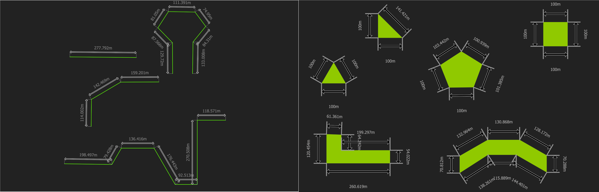

# Tutorial and examples of how to use the QGIS geometry generator

Tutorial and examples of how to use the QGIS geometry generator.

The geometry generator in QGIS is a estrange rendering tool that some users fear
and with which they are not familiar. In this repo I will try to teach how to
use the tool and reveal the great power it hides.

## What is the QGIS geometry generator

**From QGIS documentation**
The geometry generator symbol layer allows to use expression syntax to generate
a geometry on the fly during the rendering process. The resulting geometry does
not have to match with the original geometry type and you can add several
differently modified symbol layers on top of each other.

## Special Thanks To

This is the people that inspire me to create this repo and from who I learn so
much!

**Michel Stuyts:**

- [Michel Stuyts
  GitLab](https://gitlab.com/GIS-projects/qgis-geometry-generator-examples) 
- [Michel Stuyts Page](https://michelstuyts.be/)

**Anita Graser:**

- [Anita Graser GitHub](https://github.com/anitagraser/QGIS-resources)
- [Anita Graser Page](https://anitagraser.com/)

**Klas Karlsson:**

- [Klas Karlsson GitHub](https://github.com/klakar/QGIS_resources)
- [Klas Karlsson
  YouTube](https://www.youtube.com/channel/UCxs7cfMwzgGZhtUuwhny4-Q)

**QGIS Community.**

- [QGIS Web](https://www.qgis.org/en/site/)

## Available Tutorials

Learn how use the geometry generator with this tutorials and see some tricks
using some clever expressions that can be helpful for your work flow

### Smart Dimensions

[Dimensions](/tutorials/dimensions)

Learn how add smart and dynamic dimensions for your geometries ( lines and
polygon)

## How use the .qml files

[QML Files](/qml)

The .qml files are used for sharing the different layes styles in QGIS, use them
to see the different representations of the geometry generator

## Styles directory (qml)

here you have the directory of qml files to be used in QGIS

### Dimensions

[Dimensions](/qml/dimensions)

Add smart dimensions to you geometries, so when you change some vertex o line
the measure changes

## Español

Voy a proveer también los materiales 
[En Español](/es/README.md)

## License

[MIT License](LICENSE.md)
