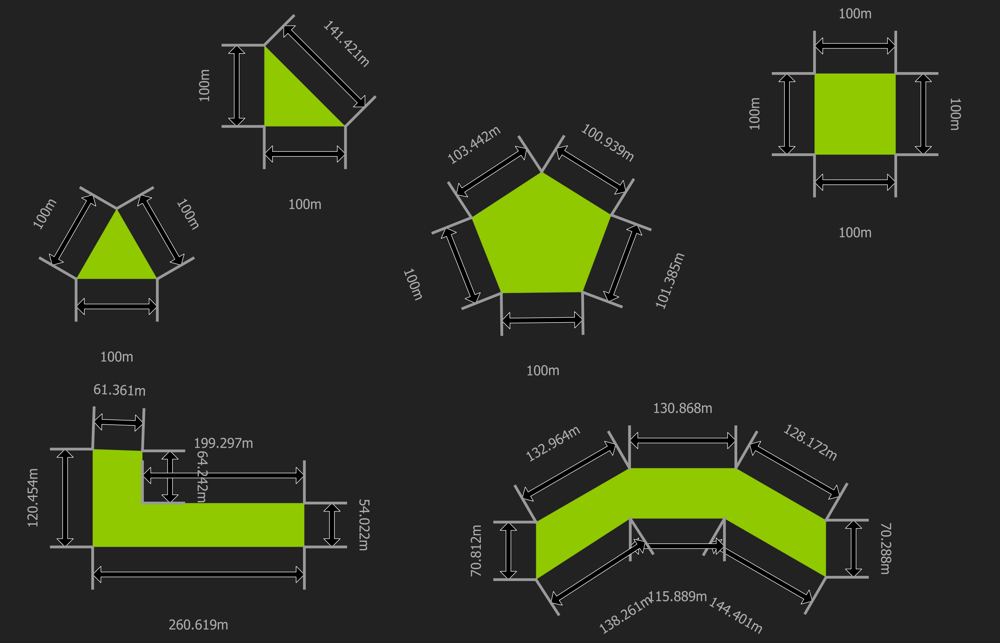
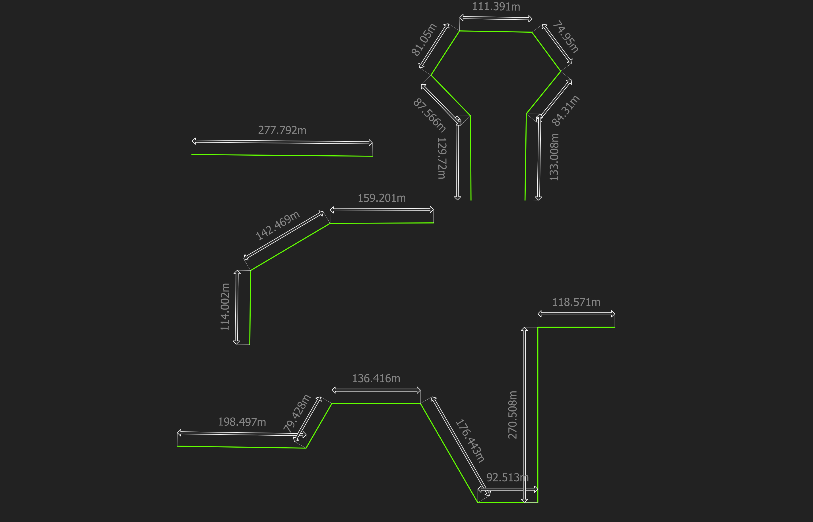

# Dimensions

Visualizing dimensions in geometries is usually one of the most common needs
when planning. This task is usually easy with CAD or BIM software, however, it
is very difficult to perform in GIS.

Some ways of performing this task involve calculating the different dimensions
of our geometry in the fields of the attribute table, but this creates a problem
since every time a geometry is added or changed, we must recalculate the
dimensions in the table of attributes which is not optimal.

Below are some examples of how to use the geometry generator to add dimensions
to our geometries in this way we will not have to calculate fields with the
measurements since these will change or be added every time we modify or create
a geometry

## QGIS versions available

Use this .qml with: 

- QGIS 3.8

## CRS and metric system

All of this dimensions are in meters because the CRS is EPSG:5367

## Polygon with dimensions

Add smart dimensions to you geometries, so when you change some vertex o line
the measure changes

## Line with dimensions

Add smart dimensions to you geometries, so when you change some vertex o line
the measure changes
